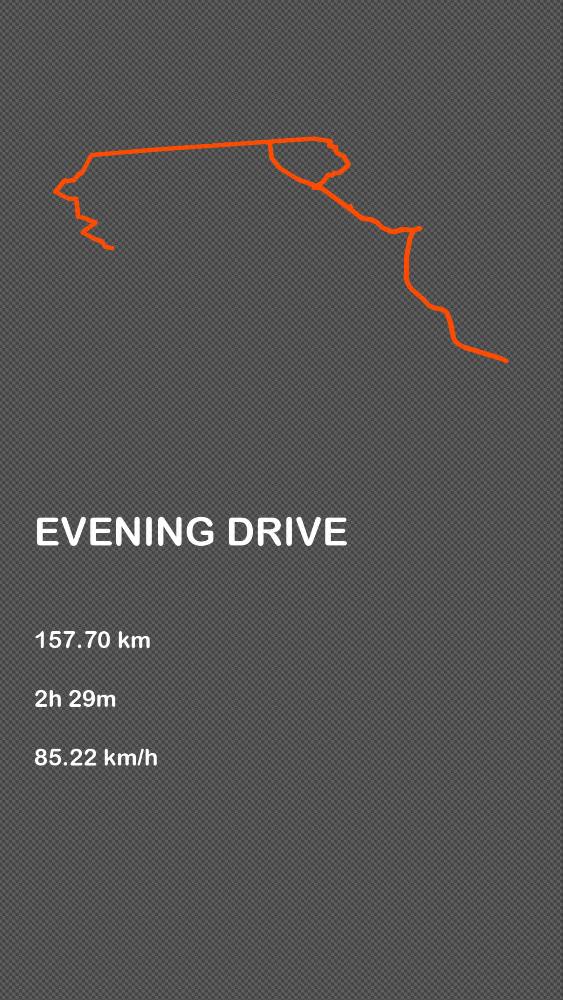

# gpx-to-image
Convert gpx track to image preview with basic info. 

Inspired by Strava track image when sharing it.

## Usage

### Install dependencies

```sh
source venv/bin/activate
```

```sh
python -m pip install -r ./requirements.txt
```

### Run script

```sh
python main.py my-gpx-file.gpx "my-title"
```

## Example

```sh
python main.py evening-drive.gpx "Evening drive"
```

